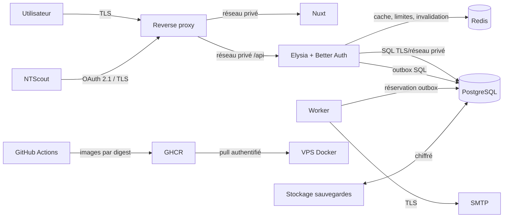

# Threat model NTAuth V1

- Version : 1.0
- Date de revue : 2026-08-09
- Périmètre : NTAuth, NTScout et déploiement VPS Docker
- Méthode : STRIDE
- Ticket : NTAUTH-108

## Objectif et hypothèses

NTAuth est l'autorité d'identité et d'autorisation de NeoTamia. PostgreSQL est la source de
vérité. Redis ne contient que des compteurs, caches et verrous reconstructibles. Le navigateur,
NTScout, Internet, le reverse proxy, les registres OCI et les opérateurs sont considérés comme des
frontières distinctes.

Le modèle suppose un hôte Linux maintenu, Docker non exposé sur le réseau, TLS terminé par un
reverse proxy approuvé et des secrets injectés au démarrage. La compromission de l'hôte, du compte
GitHub propriétaire ou d'un administrateur PostgreSQL sort du périmètre applicatif ; elle reste
traitée par les contrôles d'exploitation et la rotation des secrets.

## Actifs à protéger

| Actif                                     | Exigence principale             | Impact d'une compromission              |
| ----------------------------------------- | ------------------------------- | --------------------------------------- |
| Identités, mots de passe et MFA           | confidentialité, intégrité      | prise de contrôle de comptes            |
| Sessions, codes, access et refresh tokens | confidentialité, usage unique   | usurpation et persistance               |
| Clés de signature OAuth                   | confidentialité, rotation       | émission de tokens arbitraires          |
| Organisations, grants et policies         | intégrité, cloisonnement        | élévation de privilèges inter-tenant    |
| Journal d'audit                           | intégrité, disponibilité        | perte de preuve et non-détection        |
| Outbox email                              | intégrité, confidentialité      | détournement de récupération/invitation |
| Images OCI et chaîne CI                   | provenance, intégrité           | exécution de code compromis             |
| Sauvegardes PostgreSQL                    | confidentialité, restaurabilité | fuite ou perte durable de données       |

## Frontières et flux

Les données non fiables entrent par les requêtes HTTP, paramètres OAuth, documents IAM, emails,
variables d'environnement, headers du proxy et artefacts téléchargés. Chaque frontière doit
valider ses entrées sans faire confiance à une validation effectuée en amont.

## Barème

- Impact : 1 faible, 2 modéré, 3 majeur, 4 critique.
- Vraisemblance : 1 rare, 2 possible, 3 probable, 4 fréquente.
- Score : impact × vraisemblance.
- `Critical` : 12–16 ; `Major` : 8–11 ; `Moderate` : 4–7 ; `Minor` : 1–3.

Un finding Critical ou Major bloque la production tant qu'il n'est pas `Mitigated` ou accepté
explicitement par le propriétaire du risque. Une tâche planifiée ne vaut pas acceptation.

## Registre STRIDE

| ID    | STRIDE                 | Menace et scénario                                              | Score initial | Mitigation vérifiable                                                                    | Propriétaire | État      |
| ----- | ---------------------- | --------------------------------------------------------------- | ------------: | ---------------------------------------------------------------------------------------- | ------------ | --------- |
| TM-01 | Spoofing               | Brute force ou credential stuffing sur login/récupération       |   12 Critical | limites Redis IP+sujet, lockout borné, MFA admin, métriques ; NTAUTH-104                 | NTAuth       | Planned   |
| TM-02 | Spoofing               | Vol ou rejeu d'un code/token OAuth                              |       8 Major | PKCE S256, code 5 min usage unique, rotation refresh, révocation, JWT 15 min             | NTAuth       | Mitigated |
| TM-03 | Tampering              | Modification inter-tenant de grants ou policies                 |       8 Major | contrôle serveur organisation/rôle, transactions, Deny prioritaire, tests croisés        | NTAuth       | Mitigated |
| TM-04 | Tampering              | Altération ou suppression des preuves d'audit par l'application |       8 Major | triggers append-only, suppression limitée à la purge, export/rétention ; NTAUTH-105      | NTAuth       | Mitigated |
| TM-05 | Repudiation            | Action sensible impossible à corréler                           |    6 Moderate | request ID, acteur, résultat et metadata filtrée ; logs structurés NTAUTH-111            | NTAuth       | Planned   |
| TM-06 | Information disclosure | Token, secret, PII ou policy complète dans logs/métriques       |       8 Major | minimisation, redaction centrale et tests canaris ; NTAUTH-105/111                       | NTAuth       | Planned   |
| TM-07 | Information disclosure | Mauvais CORS/CSP/cookie ou proxy forgé                          |   12 Critical | same-origin, allowlist, Secure/HttpOnly/SameSite, CSP et proxies approuvés ; NTAUTH-107  | NTAuth       | Mitigated |
| TM-08 | Denial of service      | Saturation API, PostgreSQL ou Redis par requêtes coûteuses      |       9 Major | limites globales/ciblées, tailles bornées, timeouts, budgets conteneurs ; NTAUTH-104/106 | NTAuth       | Planned   |
| TM-09 | Denial of service      | Panne Redis accorde un droit ou bloque durablement              |       8 Major | permissions reviennent à PostgreSQL, limites fail-closed ciblées, readiness et alertes   | NTAuth       | Mitigated |
| TM-10 | Elevation of privilege | Confusion rôle plateforme/rôle organisation                     |       8 Major | tables et gardes distinctes, MFA plateforme, tests d'autorisation                        | NTAuth       | Mitigated |
| TM-11 | Elevation of privilege | JWT valide pour mauvais issuer/audience/service                 |   12 Critical | ES256, claims stricts, audience/issuer/scope/service et session active vérifiés          | NTAuth       | Mitigated |
| TM-12 | Tampering              | Image ou dépendance compromise                                  |   12 Critical | versions exactes, actions pinées, image non-root, digest, SBOM et scan ; NTAUTH-109      | Platform     | Planned   |
| TM-13 | Information disclosure | Secrets intégrés à une image ou au Compose                      |   12 Critical | fichiers Docker secrets, scan des couches, aucun défaut production ; NTAUTH-106/109      | Platform     | Planned   |
| TM-14 | Tampering              | Migration concurrente ou rollback destructif                    |       8 Major | advisory lock, expand/contract, préflight et sauvegarde ; NTAUTH-113                     | NTAuth       | Planned   |
| TM-15 | Denial of service      | Sauvegarde inutilisable lors d'un incident                      |   12 Critical | checksum, chiffrement, restauration isolée et RPO/RTO mesurés ; NTAUTH-112               | Platform     | Planned   |
| TM-16 | Spoofing               | Email d'invitation/récupération détourné                        |       8 Major | token aléatoire hashé, usage unique, expiration, email exact, TLS SMTP                   | NTAuth       | Mitigated |

## Invariants déjà démontrés

- inscription publique et Dynamic Client Registration désactivées ;
- OAuth Authorization Code avec PKCE S256 et redirect URI exacte ;
- secrets clients et tokens opaques stockés sous forme hashée ;
- access tokens ES256 courts, refresh tokens rotatifs et révocables ;
- sélection d'organisation et grant de service vérifiés avant émission ;
- MFA frais sur les opérations plateforme ;
- IAM fail-closed, Deny prioritaire et ETag réévalué à chaque requête protégée ;
- audit des mutations sensibles dans la transaction métier ;
- images applicatives non-root basées sur des variantes `slim` exactes ;
- dépendances externes, images de service et actions CI épinglées.

## Risques résiduels et règle de clôture

Les findings `Planned` sont des bloqueurs de production et restent liés aux tickets du milestone H.
NTAUTH-108 ne peut être clos qu'après une nouvelle exécution de la revue documentée dans
[`security-review.md`](./security-review.md), sans finding Critical/Major non traité. Une acceptation
de risque doit mentionner le propriétaire, la justification, l'échéance et les compensations ; elle
ne peut pas être inférée d'un ticket reporté.

## Déclencheurs de nouvelle revue

- changement de provider OAuth, algorithme JWT ou durée de token ;
- nouvelle méthode d'authentification ou nouveau rôle privilégié ;
- nouvelle frontière réseau, stockage ou fournisseur externe ;
- exposition d'une API publique supplémentaire ;
- incident de sécurité, restauration réelle ou finding de dépendance Critical ;
- au minimum une fois par an.
